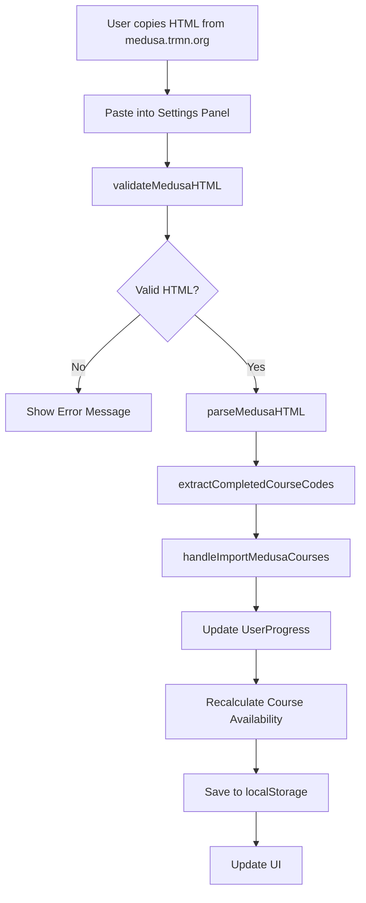

# Medusa Import Feature

## Overview

The TRMN Course Tracker now includes a powerful feature to import completed courses directly from your medusa.trmn.org academic record. This eliminates the need to manually mark each completed course, saving significant time for users with extensive course histories.

## How to Use

### Step-by-Step Instructions

1. **Access the Settings Panel**

   - Open the TRMN Course Tracker application
   - Look for the "Import from Medusa" section in the Settings panel (bottom sidebar)

2. **Get Your Medusa Data**

   - Log in to [medusa.trmn.org](https://medusa.trmn.org)
   - Navigate to your user page (click your name or go to `/user`)
   - Click the "Academic Record" tab
   - Right-click anywhere on the page and select "View Page Source" (or press `Ctrl+U`)
   - Select all content (`Ctrl+A`) and copy it (`Ctrl+C`)

3. **Import Your Courses**

   - Return to the TRMN Course Tracker
   - Paste the HTML content into the textarea in the "Import from Medusa" section
   - Click "Import Courses"
   - Wait for the success message confirming how many courses were imported

4. **Verify Import**
   - Check the skill tree to see your completed courses marked in green
   - Use the Progress Panel to see your updated completion statistics

### Supported Course Categories

The import feature supports all major TRMN course categories:

- **RMN Courses** (SIA-RMN-xxxx)
- **RMACS Specialty Courses** (RMACA-AOPA-xxx)
- **Mannheim University Courses** (MU-xxx-xx)
- **Warrant Courses** (courses ending in 'W')

### Course Code Patterns Recognized

- Standard TRMN: `SIA-RMN-0001`, `SIA-SRN-20W`, `SIA-SRN-101C`
- RMACS Aviation: `RMACA-AOPA-E01`, `RMACA-AOPA-R15`
- Mannheim University: `MU-BEK-01`, `MU-BEK-12`

## Technical Implementation

### Architecture

The Medusa import feature consists of three main components:

1. **Parser Module** (`src/utils/medusaParser.ts`)

   - Validates and parses medusa.trmn.org HTML
   - Extracts course information using DOM parsing
   - Handles multiple course categories and formats

2. **Settings Panel Integration** (`src/components/SettingsPanel.tsx`)

   - Provides user interface for HTML input
   - Handles import workflow and user feedback
   - Shows success/error messages

3. **App Integration** (`src/App.tsx`)
   - Integrates imported courses with existing progress tracking
   - Updates course availability based on new completions
   - Persists imported data to localStorage

### Data Flow

### Key Functions

#### `parseMedusaHTML(htmlContent: string): MedusaParseResult`

- Parses complete HTML from medusa.trmn.org user page
- Extracts courses from RMN, RMACS Specialty, and Mannheim University tabs
- Returns structured data with courses, errors, and parse date

#### `validateMedusaHTML(htmlContent: string): { valid: boolean; reason?: string }`

- Validates that HTML contains expected medusa.trmn.org indicators
- Prevents processing of invalid or non-medusa content
- Provides helpful error messages for troubleshooting

#### `extractCompletedCourseCodes(medusaCourses: MedusaCourse[]): string[]`

- Converts parsed course data to course codes
- Filters out invalid or empty course codes
- Returns clean array of course codes for import

### Error Handling

The system includes comprehensive error handling:

- **HTML Validation**: Checks for medusa.trmn.org indicators
- **Parse Errors**: Graceful handling of malformed HTML
- **Course Extraction**: Robust pattern matching for various course formats
- **User Feedback**: Clear success/error messages in the UI

### Security Considerations

- HTML parsing is done client-side using DOMParser
- No server communication required for import
- User data remains local to their browser
- No sensitive information is transmitted

## Testing

The feature includes comprehensive test coverage:

### Parser Tests (`src/utils/medusaParser.test.ts`)

- Tests for all supported course formats
- HTML validation scenarios
- Error handling edge cases
- Course code extraction patterns

### Settings Panel Tests (`src/components/SettingsPanel.test.tsx`)

- UI component behavior
- Import button states
- User interaction workflows
- Accessibility compliance

### Test Coverage

- **20 tests** for medusaParser utility
- **19 tests** for SettingsPanel component (including 7 new import tests)
- **Total: 66 tests** passing across the entire application

## Troubleshooting

### Common Issues

1. **"Invalid HTML format" Error**

   - Ensure you copied the complete page source from medusa.trmn.org
   - Make sure you're logged in and on the correct user page
   - Verify you're on the Academic Record tab

2. **"No courses found" Error**

   - Confirm you have completed courses in your medusa record
   - Check that you copied the full HTML, not just a portion
   - Try refreshing medusa.trmn.org and copying again

3. **Some Courses Not Imported**
   - Check if the course codes match supported patterns
   - Verify courses are listed in the Academic Record tab
   - Some courses may have non-standard naming that isn't recognized

### Browser Compatibility

The feature works in all modern browsers that support:

- DOMParser API
- ES6+ JavaScript features
- Local storage

## Future Enhancements

Potential improvements for future versions:

1. **Direct API Integration**: Connect directly to medusa.trmn.org API (if available)
2. **Course Mapping**: Handle courses with different names but same codes
3. **Grade Import**: Include grade information in addition to completion status
4. **Incremental Updates**: Update only new courses since last import
5. **Export Functionality**: Export progress back to other formats

## Security and Privacy

- All processing happens locally in your browser
- No data is sent to external servers
- Your medusa.trmn.org credentials are never stored or transmitted
- Course completion data is stored locally using browser localStorage

---

_For technical support or feature requests, please open an issue in the GitHub repository._
